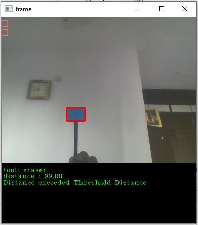

# Virtual-Blackboard-using-Image-Processing
Project created by Devansh Akruvala
## Screenshots
#### You can write on blackboard with any colour and switch between pen and eraser from toolbox  

#### Similarities of Triangle is used to compute distance between camera and pen

Above figure shows a triangle, in Triangle ABC let A be the webcam, BC is the known width provided by the user and is denoted by “kw”, AD be the known distance provided by the user and is denoted by “kd”. Therefor initially the distance of object form camera is kd. Now in Triangle AEF, EF is the width of object in pixel and is denoted by “pw”. And AG is the focal length denoted by “f”.
Now,

Angle A in ABC ~ Angle A in AEF (Common angle)

Angle B in ABC ~ Angle E in AEF (Alternate angle)

Angle C in ABC ~ Angle F in AEF (Alternate angle)

Therefor by AAA (Angel Angle Angle) Property we can say that Triangle ABC is similar to Triangle AEF.

There for it satisfy the property that Corresponding sides are all in the same proportion.

Therefor,      
    
$$\frac{AE}{AD}=\frac{EF}{BC}$$

Therefor,  
$$\frac{f}{kd}= \frac{pw}{kw}$$

 Therefor,

$$f=\frac{pw\times kd}{kw}$$

Now this f (focal length can be used to calculate distance of object from webcam).

Let “D” be the distance from webcam Then “D” can be given by.

This D is the distance between web cam and object now task of writing or erasing will be done only when this D is less than Threshold distance “TD” provided by the user.

for more detail refer: https://devansh-akruvala.blogspot.com/2020/10/virtual-blackboard-using-image.html

Link to the [Research Paper](https://drive.google.com/file/d/1GXBC8ku8Bi2qNl2FV3QynngLsswLX4GP/view?usp=sharing) for this project. 

## Video

